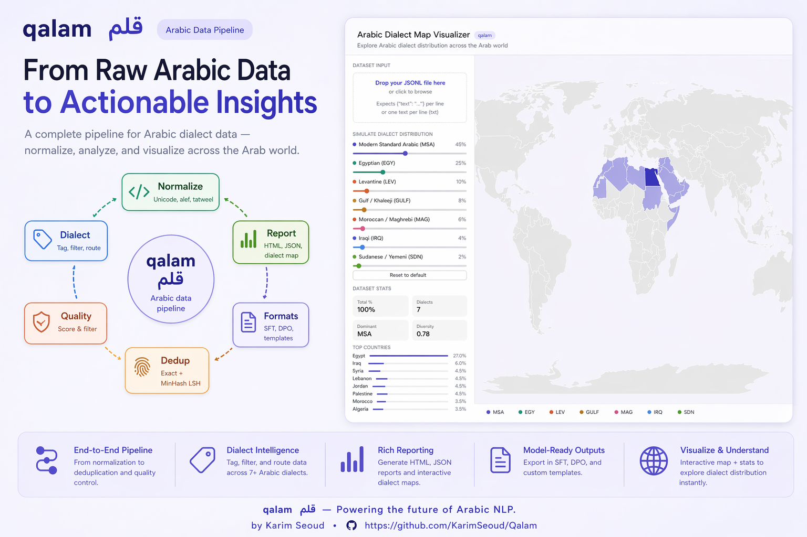
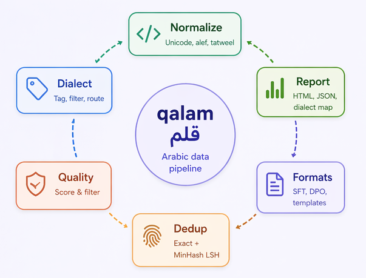

# qalam 🔤

> A pipeline for preparing high-quality Arabic datasets for LLM training and fine-tuning.

Arabic LLM teams have historically had to build their own preprocessing pipelines from scratch. This project packages the community's accumulated knowledge into one opinionated, well-tested toolkit — with zero required model downloads.

---
README.ar.md شوف ده لو عاوز الشرح بالعربى 

---

<p align="center">
  
  &nbsp;&nbsp;
  
</p>

## Why this exists

Unlike English, Arabic presents unique data quality challenges:

- **Script complexity** — multiple Unicode forms for the same character (أ إ آ ا), tatweel (ـ) elongation, diacritics that may or may not be meaningful
- **Dialect fragmentation** — MSA, Egyptian, Levantine, Gulf, Maghrebi, Iraqi, and Sudanese are linguistically distinct. A model trained on "Arabic" that's actually 70% Egyptian dialect will underperform on MSA
- **No unified pipeline** — every Arabic LLM paper describes a custom data pipeline. We fix that

---

## Benchmark — dialect detection

qalam's dialect detector scores **78.6% accuracy on MADAR-6**, the standard Arabic dialect identification benchmark — within **1.4 points of MARBERT** (a 500 MB fine-tuned Arabic BERT), while running as **pure Python in 400 KB with no GPU**.

| System | MADAR-6 accuracy | Install size | GPU |
|--------|:----------------:|:------------:|:---:|
| Random baseline | 16.7% | — | — |
| Salameh et al. 2018 — lexicon SOTA | ~67.0% | — | No |
| **qalam** — `DialectDetector(profile="madar")` | **78.6%** | **400 KB** | **No** |
| MARBERT-DialectID | ~80.0% | ~500 MB | Recommended |
| CAMeL ADIDA — flagship | ~85.0% | ~1.5 GB | Required |

The default detector (no profile) reaches **91% precision** when allowed to abstain — use it as a high-confidence pre-filter for any Arabic pipeline. Full methodology, per-class breakdown, and reproduction steps in **[BENCHMARKS.md](BENCHMARKS.md)**.

---

## Features

| Module | What it does |
|--------|-------------|
| `normalize` | Unicode normalization, alef/hamza unification, tatweel removal, diacritics, Persian chars, bidi controls, numeral conversion |
| `dialect` | Detects MSA / EGY / LEV / GULF / MAG / IRQ / SDN / YEM — tag, filter, or route. Optional **MADAR profile** (78.6% accuracy, no GPU) |
| `quality` | Quality scoring (Arabic ratio, repetition, noise, boilerplate, toxicity) with configurable thresholds and flag codes |
| `dedup` | Exact dedup (blake2b) + near-dedup (MinHash LSH, 64-bit) — cross-dataset contamination detection included |
| `formats` | SFT, DPO, pretraining — **12 chat templates**: ChatML, Llama-3, Llama-2, Mistral, Jais, Gemma-2, Gemma-4, Command-R, Phi-3, DeepSeek, Alpaca, Vicuna |
| `report` | Full dataset report card with **interactive dialect map** — exportable as HTML, JSON, or Markdown |

### 🗺️ Dialect Map Visualizer

Upload your dataset and instantly see how it's distributed across the Arab world. Spots dialect bias before training.

Open `scripts/dialect_map_visualizer.html` in any browser — no server needed.

---

## Install

```bash
pip install qalam
```

**Zero required dependencies** for core functionality. Optional extras:

```bash
pip install qalam[hub]    # HuggingFace Hub push
pip install qalam[viz]    # Web visualizer server
pip install qalam[all]    # Everything
```

---

## Quick start

### Python API

```python
from qalam import Pipeline

# One-liner: normalize → dialect filter → quality filter → dedup
result = Pipeline().run(my_texts)
print(f"Kept {len(result.texts)} / {len(my_texts)} examples")
```

### Full pipeline with config

```python
from qalam import Pipeline
from qalam.pipeline import PipelineConfig
from qalam.normalize import NormalizerConfig
from qalam.quality import QualityConfig

pipeline = Pipeline(PipelineConfig(
    normalizer=NormalizerConfig(diacritics="strip"),
    quality=QualityConfig(min_quality_score=0.6),
    dialect_filter=["MSA", "EGY"],       # Keep only MSA and Egyptian
    run_dedup=True,
    generate_report=True,
    report_path="report.html",           # Saves interactive HTML report
))

result = pipeline.run(texts)
```

### CLI

```bash
# Clean a dataset
qalam clean data.jsonl --output clean.jsonl

# Keep only MSA, generate a report
qalam clean data.jsonl \
  --dialect msa \
  --output msa_clean.jsonl \
  --report-html report.html

# Just dedup
qalam dedup data.jsonl --threshold 0.8 --output deduped.jsonl

# Generate a report card
qalam report data.jsonl --out report.html --json report.json

# Show available options
qalam info
```

---

## Module examples

### Normalization

```python
from qalam import QalamNormalizer
from qalam.normalize import NormalizerConfig

# Default: strip diacritics, unify alef, remove tatweel
normalizer = QalamNormalizer()
clean = normalizer.normalize("مَرْحَبًا بِكُم في هَذا النَّص")
# → "مرحبا بكم في هذا النص"

# Classical Arabic: keep diacritics
classical = QalamNormalizer(NormalizerConfig(diacritics="keep"))

# See what changed
diff = normalizer.diff(original, clean)
# → {"changed": True, "changes": ["diacritics stripped", "2 alef variant(s) unified"]}
```

### Dialect detection

```python
from qalam import DialectDetector

# Default: fast IDF-weighted lexicon (no model, instant)
detector = DialectDetector()

result = detector.detect("عايز أروح السينما النهارده")
# DialectResult(dialect="EGY", dialect_name="Egyptian", confidence=0.85, ...)

# High-accuracy mode: MADAR profile (78.6% on MADAR-6, pure Python, 400 KB)
detector = DialectDetector(profile="madar")

# Filter a corpus to MSA only
msa_texts = detector.route(texts, keep=["MSA"])

# Tag every example with its dialect
tagged = detector.tag_batch(texts)
# [{"text": "...", "dialect": "EGY", "confidence": 0.85, ...}, ...]

# Corpus distribution (used by the map visualizer)
dist = detector.distribution(texts)
# {"total": 1000, "dialects": {"EGY": {"count": 350, "percentage": 35.0, ...}, ...}}
```

### Quality scoring

```python
from qalam import QualityScorer
from qalam.quality import QualityConfig

scorer = QualityScorer(QualityConfig(min_quality_score=0.55))

result = scorer.score(text)
# QualityResult(score=0.82, passed=True, arabic_ratio=0.89, ...)

# Filter a batch
clean = scorer.filter_batch(texts)

# Summary statistics
summary = scorer.summary(texts)
# {"total": 1000, "passed": 847, "pass_rate": 84.7, "flag_breakdown": {...}}
```

### Deduplication

```python
from qalam import Deduplicator

deduper = Deduplicator()
result = deduper.dedup(texts)
print(f"Removed {result.removed_count} duplicates ({result.duplicate_rate:.1f}%)")

# Cross-dataset contamination check
report = deduper.contamination_report(train_texts, test_texts)
# {"contamination_rate": 2.3, "contaminated_train_examples": 230, ...}
```

### Format conversion

```python
from qalam import FormatConverter
from qalam.formats import SFTExample, DPOExample

converter = FormatConverter(default_template="chatml")

# SFT example → formatted string
example = SFTExample(
    instruction="ما هي عاصمة مصر؟",
    input="",
    output="عاصمة مصر هي القاهرة.",
)

# Pick any of the 12 supported templates
formatted = converter.sft_to_formatted(example, template="llama3")    # Llama 3 / 3.1 / 3.2
formatted = converter.sft_to_formatted(example, template="llama2")    # Llama 2 Chat
formatted = converter.sft_to_formatted(example, template="mistral")   # Mistral / Mixtral / ALLaM
formatted = converter.sft_to_formatted(example, template="chatml")    # Qwen, Yi, AceGPT, Jais-v2
formatted = converter.sft_to_formatted(example, template="jais")      # Jais (Arabic-first)
formatted = converter.sft_to_formatted(example, template="gemma4")    # Gemma 4
formatted = converter.sft_to_formatted(example, template="gemma2")    # Gemma 2 / 3
formatted = converter.sft_to_formatted(example, template="command-r") # Command-R / Aya / Aya-Expanse
formatted = converter.sft_to_formatted(example, template="phi3")      # Phi-3 / Phi-3.5
formatted = converter.sft_to_formatted(example, template="deepseek")  # DeepSeek V2 / V3 / R1
formatted = converter.sft_to_formatted(example, template="alpaca")    # Stanford Alpaca / academic SFT
formatted = converter.sft_to_formatted(example, template="vicuna")    # Vicuna / FastChat

# Gemma 4 — chain-of-thought thinking mode
from qalam.formats import CHAT_TEMPLATES
CHAT_TEMPLATES["gemma4"]["enable_thinking"] = True
formatted = converter.sft_to_formatted(example, template="gemma4")

# Save as JSONL
converter.save_jsonl(examples, "train.jsonl")

# Push to HuggingFace Hub
converter.push_to_hub(examples, "your-org/arabic-sft-dataset")

# List all templates
converter.list_templates()
# {"chatml": "ChatML (Qwen/Yi/InternLM)", "llama3": "Llama 3", "llama2": "Llama 2 / Llama 2 Chat (Meta)",
#  "mistral": "Mistral / Mixtral", "jais": "Jais (Arabic LLM)", "gemma4": "Gemma 4 (Google DeepMind)",
#  "gemma2": "Gemma 2 / Gemma 3 (Google DeepMind)", "command-r": "Command-R / Aya (Cohere)",
#  "phi3": "Phi-3 / Phi-3.5 (Microsoft)", "deepseek": "DeepSeek V2 / V3 / R1",
#  "alpaca": "Alpaca (Stanford / academic SFT)", "vicuna": "Vicuna 1.1 / FastChat"}
```

### Report card

```python
from qalam.report import ReportGenerator

gen = ReportGenerator()
report = gen.generate(texts)

# Print to terminal
gen.print_summary(report)

# Save interactive HTML (dialect map + charts)
gen.save_html(report, "report.html", dataset_name="My Arabic Dataset")

# HuggingFace dataset card section
print(gen.to_markdown(report))

# Machine-readable JSON
gen.save_json(report, "report.json")
```

---

## Configuration presets

Three YAML presets are included in `configs/`:

```bash
# Pretraining — high recall, all dialects, dedup
qalam clean corpus.jsonl --config configs/pretraining.yaml

# SFT fine-tuning — higher precision, strict dedup
qalam clean data.jsonl --config configs/sft.yaml

# Classical Arabic — keep diacritics, strict MSA filter
qalam clean quran_tafsir.jsonl --config configs/classical.yaml
```

---

## Dialect map visualizer

Open `scripts/dialect_map_visualizer.html` in a browser:

- **Drag and drop** your JSONL file for instant dialect analysis
- **Adjust sliders** to simulate different dataset compositions
- **Hover countries** to see which dialect they contribute
- **Bias alert** fires when one dialect exceeds 65% of the corpus

No server, no dependencies — pure HTML/JS.

---

## Supported dialects

| Code | Dialect | Countries |
|------|---------|-----------|
| MSA | Modern Standard Arabic | All Arabic-speaking countries |
| EGY | Egyptian | Egypt |
| LEV | Levantine | Syria, Lebanon, Jordan, Palestine |
| GULF | Gulf / Khaleeji | Saudi Arabia, UAE, Kuwait, Qatar, Bahrain, Oman |
| MAG | Moroccan / Maghrebi | Morocco, Algeria, Tunisia, Libya |
| IRQ | Iraqi | Iraq |
| SDN | Sudanese | Sudan |
| YEM | Yemeni | Yemen |

---

## Supported chat templates

| Template | Models |
|----------|--------|
| `chatml` | Qwen 2.5/3, Yi, AceGPT, InternLM, OpenHermes, Zephyr |
| `llama3` | Llama 3, Llama 3.1, Llama 3.2 |
| `llama2` | Llama 2 Chat, older Jais / AceGPT builds |
| `mistral` | Mistral, Mixtral, ALLaM (SDAIA), Mistral-Arabic |
| `jais` | Jais (Arabic-first LLM, MBZUAI) |
| `gemma4` | Gemma 4 E2B / E4B / 26B / 31B — set `enable_thinking=True` for chain-of-thought |
| `gemma2` | Gemma 2 / Gemma 3 |
| `command-r` | Command-R, Command-R+, Aya-23, Aya-Expanse (Cohere) |
| `phi3` | Phi-3, Phi-3.5 Mini / Small / Medium / MoE (Microsoft) |
| `deepseek` | DeepSeek-V2, DeepSeek-V3, DeepSeek-R1 |
| `alpaca` | Stanford Alpaca — academic Arabic SFT default |
| `vicuna` | Vicuna 1.1, FastChat |

---

## Development

```bash
git clone https://github.com/KarimSeoud/Qalam qalam
cd qalam
pip install -e ".[dev]"

# Run tests
pytest tests/ -v

# Format
black qalam/ tests/
ruff check qalam/
```

---

## Roadmap

- [x] MADAR-6 dialect benchmark (78.6% accuracy, pure Python, no GPU)
- [x] Learned dialect profile — linear weights extracted from logistic regression, 400 KB JSON
- [x] 12 chat templates covering every major open-source Arabic LLM family
- [x] SDN/YEM dialect split
- [ ] AI-powered quality rewriter (Claude/GPT backend — fixes bad text instead of filtering it)
- [ ] Perplexity scoring with a small Arabic LM (CAMeL Tools integration)
- [ ] HuggingFace Datasets streaming support for large corpora
- [ ] Web UI for the full pipeline (not just the map)
- [ ] Benchmark: quality pipeline vs raw data on downstream Arabic NLP tasks

---

## Contributing

Contributions welcome — especially:
- **Dialect lexicon improvements** (`qalam/dialect.py`)
- **New chat templates** (`qalam/formats.py`)
- **Toxicity/boilerplate patterns** (`qalam/quality.py`)
- **Bug reports and dataset-specific issues**

Please open an issue before a large PR.

---

## License

MIT — see [LICENSE](LICENSE)

---

## Citation

If you use this in research, please cite:

```bibtex
@software{qalam,
  title  = {qalam: A pipeline for preparing Arabic datasets for LLM training},
  year   = {2026},
  url    = {https://github.com/KarimSeoud/Qalam}
}
```
